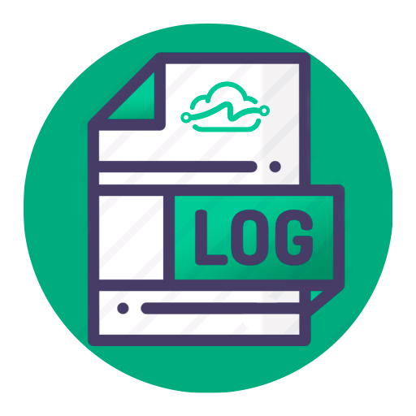

# LinkApi Log Viewer - V5



## O que é?

Esse aplicativo é um visualizador de logs para desenvolvimento na V5 que tenta emular a funcionalidade que temos dentro da plataforma. 

## Porquê?

O principal problema a ser sanado, consiste no fato de que não conseguíamos ter visualização dos logs de forma clara e objetiva, ao rodar as automações localmente, agregando empecilhos no processo de desenvolvimento e teste, pois havia a necessidade de ficar "commitando" nossa aplicação para devida visualização dos logs, gerando alta dependência da plataforma.

## Como?

A aplicação visa emular em termos de funcionalidade e aparência a plataforma, agregando facilidade ao processo de desenvolvimento e depuração das aplicações em ambiente local.

## O que preciso para utilizar?

- Os logs só irão funcionar se seu SDK estiver na última versão disponibilizada.
- Antes de subir suas automações em projetos antigos, verifique se sua pasta **logs** esta no .gitignore
- O aplicativo só funciona para logs gerados a partir do SDK da V5
- É uma ferramenta auxiliar e não tem vínculo com a API de logs da LinkApi

## Consigo utilizar em projetos antigos?

O aplicativo é uma ferramenta externa, então você acaba não tendo conflito com a sua aplicação, mas para que os arquivos de logs sejam gerados conforme esperado pelo **Log Viewer**, você precisa atualizar o SDK instalado em seu projeto e adicionar ao seu .gitignore a pasta de logs, da seguinte forma (basta adicionar ao final do arquivo, caso não esteja presente):

```bash
logs/
```

## Como funciona o refresh dos dados?

Inicialmente foi planejado usar um processamento do tipo polling com a técnica readLine (checagem linha a linha) ou mesmo a técnica watchFile (feed de mudanças de um arquivo). Após testes, chegamos a conclusão de que seria ideal fazer o carregamento por completo do arquivo inicialmente e, sob demanda do usuário, recarregar o mesmo. Entre os motivos para não usarmos as técnicas de readline e watchfile, temos:

1. Em nossos usos com a aplicação nós visualizamos os logs e vamos para o código arrumar o que estiver de errado. Utilizando o readline ou o watchFile, por sempre estar buscando proativamente por mudanças no arquivo, teríamos um consumo de memória que poderia facilmente escalar dependendo do tamanho dos logs abertos e quantas abas estão abertas.
2. O log gerado pelo Winston não é igual ao dado que você visualiza na tela, todos sabemos que hoje antes de chegar na plataforma nossos logs são agrupados por uniqueKey, ordenados por data/hora, "parseados", em resumo, temos diversos tratamentos nos logs recebidos até que realmente consigamos chegar na visualização, fazer esse processamento com um polling dos arquivos iria consumir muito mais da sua máquina.
3. O Electron é um WebView, nada mais é do que um navegador encapsulado rodando o motor V8, o que por si só já possui certo consumo agregado de memória. Sendo assim, diminuímos ao máximo o consumo, fazendo o refresh do arquivo apenas sob demanda do usuário.

Então hoje para você fazer a refresh dos arquivos na tela, tem um botão para isso ou você fecha a aba e abre novamente abrindo o novo arquivo gerado.

## Como utilizar?


## Recomendações dos desenvolvedores

O que implementamos no SDK ele da um append no arquivo de log conforme você for executando sua automação, então no fim você pode ter N sessões conforme você for executando esse arquivo vai ficando maior demorando mais para ser recarregado no aplicativo, então não se esqueçam de apagar os logs conforme eles forem ficando extremamente gigantes, nós podíamos ter colocado no SDK para ele apagar esse arquivo automaticamente depois de certo tamanho, mas preferimos dar controle total a vocês sobre o que querem visualizar. 

Obs: *Não acabem com a memória de vocês*

## Download dos arquivos
[Google Drive](https://drive.google.com/drive/u/5/folders/1x5OSAzhYZdsdNnzwWFE-LrJhY0vYggEV "Google Drive")
